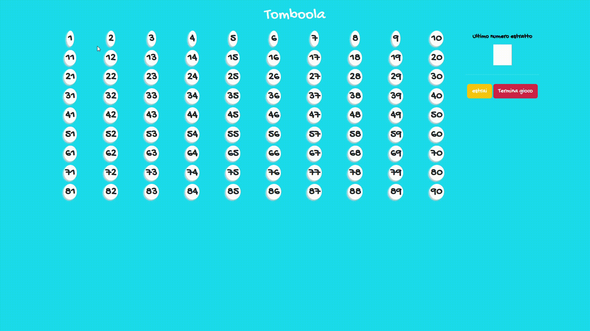

# 🎱 Tombola Web


Un semplice progetto web che simula il gioco della Tombola italiana, realizzato con HTML, CSS, Bootstrap e JavaScript. 🕹️


## 📝 Descrizione


L'applicazione genera automaticamente una griglia di 90 numeri (da 1 a 90) e permette di estrarre numeri casuali uno alla volta, evidenziando quelli già usciti. È pensata per essere usata su PC, tablet o LIM durante giochi di gruppo. 🎉





## 🛠️ Tecnologie utilizzate

- **HTML5** 📄
- **CSS3** 🎨 (con personalizzazioni e Bootstrap 5)
- **Bootstrap 5** (CDN) 🅱️
- **JavaScript** (vanilla) ✨
- **Google Fonts** (Gochi Hand) 🔤


## 🚀 Come inizializzare il progetto


1. **Clona o scarica** la repository sul tuo computer. ⬇️
2. Apri la cartella del progetto. 📁
3. Avvia il file `index.html` con un browser moderno (Chrome, Edge, Firefox, ecc). 🌐


Non sono necessarie installazioni o dipendenze aggiuntive: tutto funziona in locale senza server. 🖥️


## ✨ Funzionalità principali

- Generazione dinamica della griglia dei numeri (1-90) 🔢
- Estrazione casuale dei numeri senza ripetizioni 🎲
- Evidenziazione dei numeri estratti 🟥
- Messaggio di fine gioco quando tutti i numeri sono stati estratti 🏁
- Pulsante per ricominciare la partita 🔄


## 📁 Struttura del progetto

```
index.html
script.js
css/
  style.css
README.md
```


## 👤 Autore
- [alessiozaccato](https://github.com/alessiozaccato)


